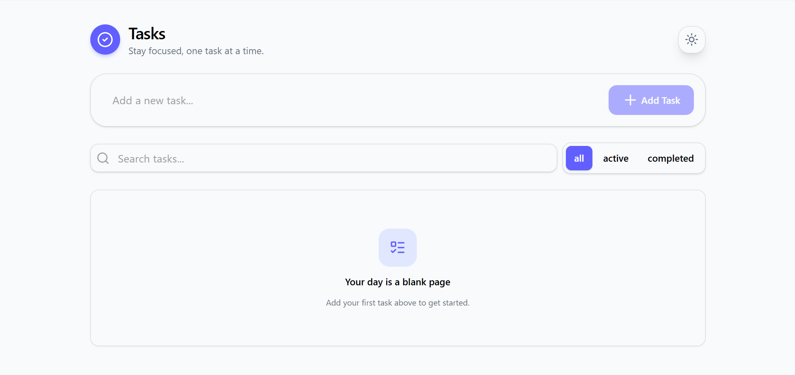
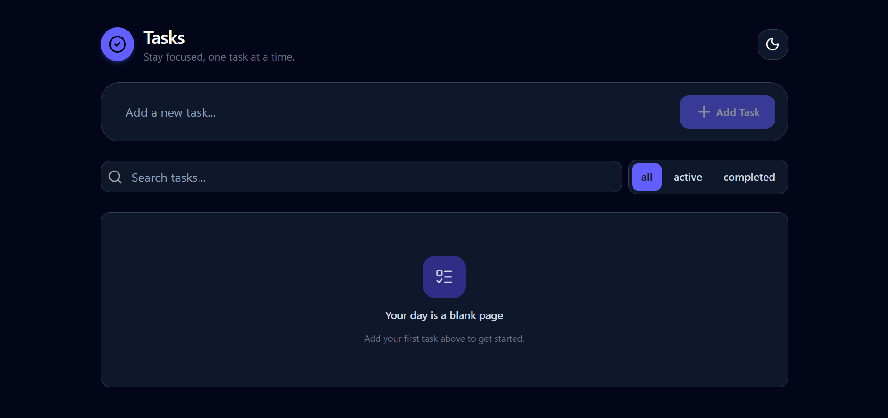

# Todo List App

A modern Todo List application built with React, TypeScript, Vite, and Tailwind CSS. This project was created to practice React fundamentals by building a complete CRUD application with a clean, responsive, and user-friendly interface.

## Features

- Add new tasks
- Edit existing tasks
- Mark tasks as completed
- Delete tasks
- Search tasks by title
- Filter tasks (All, Active, Completed)
- Persist tasks using Local Storage
- Light and Dark mode with theme persistence
- Context-aware empty states
- Responsive design

## Preview

### Light Mode

### Dark Mode

## Tech Stack

- React
- TypeScript
- Vite
- Tailwind CSS
- Lucide React

## What I Learned

Building this project helped me gain a deeper understanding of React and TypeScript by implementing a complete CRUD application from scratch.

### React

- Functional components
- Component composition
- Props
- State management with `useState`
- Side effects with `useEffect`
- Conditional rendering
- Rendering lists with `map`
- Event handling
- Controlled components
- Derived state

### TypeScript

- Creating custom types
- Typing component props
- Typing event handlers
- Reusable type aliases

### Application Logic

- CRUD operations
- Search functionality
- Todo filtering
- Local Storage persistence
- Theme management
- Contextual empty states
- Separating business logic from presentation

### UI Development

- Tailwind CSS utility classes
- Dark mode implementation
- Smooth UI transitions
- Reusable components

## Challenges

Some of the challenges I encountered while building this project included:

- Designing filtering logic without creating unnecessary state.
- Combining filtering and searching while keeping the code simple.
- Handling multiple empty states based on the application's current state.
- Deciding which components should own state and which should only receive props.
- Persisting both todos and theme preferences using Local Storage.

## License

This project was created for learning purposes.
